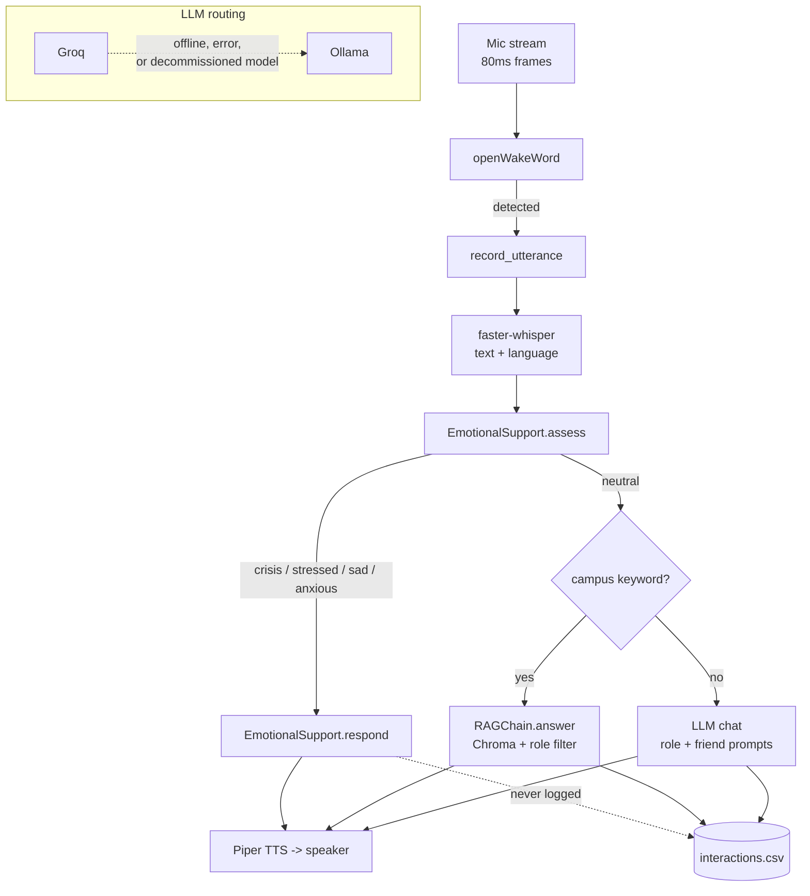

# Developer notes

The README says what this is. This is what you want before changing it.

## Shape



Everything runs on one asyncio loop in `core/pipeline.py`; every blocking call (Whisper, Piper, the HTTP clients) is pushed to an executor thread.

## The crisis path is the trust boundary

Not in the security sense. In the sense that this is the one code path where being wrong has a cost that is not measured in developer time, so it gets treated differently from the rest of the repo.

Three rules it now follows, all of which it broke before:

**1. Keywords decide a crisis, not the model.** `assess()` checks `CRISIS_PHRASES` first and returns immediately. The LLM is only consulted for the softer `STRESS_PHRASES`, and only to *escalate*. A model returning "neutral" can never turn a crisis keyword into a normal turn.

**2. The escalation does not depend on anything that can fail.** `counsellor_details()` builds its sentence from config alone. `respond()` wraps the prompt read and the LLM call in a try, and on any failure returns `_crisis_fallback()`, which still carries those details. The escalation used to be appended *after* `llm.chat()` returned, so a timeout meant the student heard nothing at all.

**3. A failed turn does not kill the kiosk.** `run_forever` catches everything around `_handle_turn`. There was no handler, so one exception ended the process; systemd restarted it, and on a Pi that means reloading Whisper, the embeddings model and Chroma before it can listen again. The person who was just talking to it got a minute of silence.

If you add a fourth place that can fail in this path, make it fail towards "the student hears who to call".

## Things that will surprise you

### The keyword lists are the multilingual layer, and they have to stay that way

Whisper transcribes Hindi and Telugu both in script and, often, romanised. `CRISIS_PHRASES` and `STRESS_PHRASES` therefore carry both spellings for each language. They were English-only, which meant a crisis in Hindi or Telugu scored `neutral` and never even reached the LLM triage, on a kiosk whose whole pitch is that it speaks three languages.

`ops/hygiene.sh` fails the build if the Devanagari or Telugu ranges disappear from the crisis list.

### A placeholder contact is worse than no contact

`config.yaml` ships `counsellor_contact: "+91-XXXXXXXXXX"`. `looks_like_placeholder()` catches that shape (and empty strings, and "TBD"), and the escalation omits the number rather than reading it out. `EmotionalSupport.__init__` logs an error about it once at startup and `ops/check_config.py` warns. Replacing it is a deployment step, not a code change.

### Keyword matching needs word boundaries

`detect_role()` used plain substring tests, so:

```
"I desire to know the exam date"    -> faculty   ("sir" inside "desire")
"three days left"                   -> staff     ("hr" inside "three")
"what is the method for applying"   -> faculty   ("hod" inside "method")
```

Getting the role wrong changes the system prompt and the RAG role filter for the whole session. The patterns are compiled with `\b` now, with the boundary omitted where a keyword ends in punctuation so `dr.` still matches.

The same pattern is still in use in two places that are *not* fixed, deliberately: `_RAG_INTENT_KEYWORDS` in `core/pipeline.py` and the phrase lists in `emotional_support.py`. Both want loose substring matching, because "exams" should match "exam" and a crisis phrase should match inside a longer sentence. Do not "fix" those the same way.

### Repo resources are repo-relative

`Path("llm/prompts/...")` resolves against the current working directory. The systemd unit sets `WorkingDirectory=/home/pi/Desktop/Jagruthi`, so production was fine and `python3 main.py` from anywhere else raised `FileNotFoundError` partway through a turn. Every module that opens a repo file now derives `_REPO_ROOT` from `__file__`. The hygiene script fails on a new bare relative `Path("llm/...")`, `Path("tts/...")`, `Path("admin/...")` or `Path("knowledge_base/...")`.

### Empty files were committed as if they were real

Four test files and `admin/dashboard.py` were zero bytes, so the repo appeared to have a test suite and a Flask dashboard. The tests are real now; the dashboard stub is deleted, because an empty file promising a feature is worse than no file. `ops/hygiene.sh` fails on any empty tracked `.py` or `.sh` that is not an `__init__.py`.

### The LLM router degrades, it does not raise

`LLMRouter.chat` tries Groq when online, falls back to Ollama on any error, and if neither is ready returns a plain apology sentence rather than raising. The pipeline speaks whatever it gets back, so that string is a user-facing message. A `model_decommissioned` error disables Groq for the rest of the run so every subsequent turn does not pay the timeout.

### Emotional sessions are not logged

`Session.set_emotional()` sets `log_enabled = False`, and `_handle_turn` checks it before calling `log_interaction`. The mode stays for the life of the session, which ends after `app.session_timeout` seconds of silence (30 by default).

## Testing

```bash
pip install pytest pyyaml
pytest tests/ -v
```

67 tests, no models, no network, no Pi. They cover the crisis path, role detection, language normalisation, session state and LLM routing, all with fakes defined in `tests/conftest.py`.

What is *not* covered, and why: everything that needs a model. Whisper transcription, Piper synthesis, ChromaDB ingestion and retrieval, openWakeWord, and GPIO all require hundreds of megabytes of dependencies or the Pi itself. CI installs only `pytest` and `pyyaml` for that reason. `not_for_you.md` says so plainly rather than implying the suite means more than it does.

## Checks

```bash
pytest tests/                # 67 tests
python3 ops/check_config.py  # every key the code reads is in config.yaml
ops/hygiene.sh               # tripwires for defects this repo has had
```

`ops/check_config.py` exists because a missing config key is a `KeyError` partway through a conversation, on a kiosk, with nobody reading the journal. It lists each key against the module that reads it.
